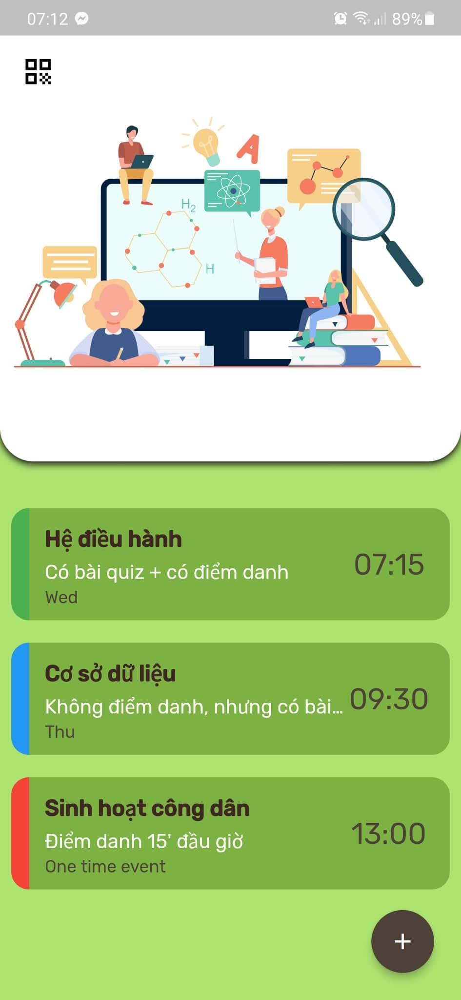

# Class Notifier

A final project of DevFest 2021
-----------------------------------------

## Authors:
🧑 **Nguyễn Đăng Tiến Thành**
- Github: [@tienthanh214](https://github.com/tienthanh214)

👽 **Lê Công Bình**
- Github: [@binhlecong](https://github.com/binhlecong)

👧 **Nguyễn Lê Bảo Thi**
- Github: [@baothi250501](https://github.com/baothi250501)

👽 **Đỗ Minh Quân**
- Github: [@Gideon2801](https://github.com/Gideon2801)

## Ideas
Due to the COVID pandemic, students all over the world have to attend online classes, which involves joining online meetings via URLs. This app is created to facilitate online studying by **delivering online link through push notification**, helping students join class on time and easily.  
Moreover, Class Notifier also make it easy for student to share class info among friends. A student can create a classroom info and then share it with his/her friends by **creating a QR code from that class**. The app will **scans the QR code and automatically imports** the class into the list.

## Features
- Save class infomation to database
    - Select importance of class
    - Specify a URL leading to the class
    - Alarm before a certain amount of time
- Push notification remind student to join class
    - Click on notification to open link instantly
    - Set class as a one-time event or repeated weekly
- Create a QR code that contain info of a classroom
- Scan the QR code and import class information

## Demo

### Home Screen

### Calendar Screen

### QR Code Screen

## Getting Started

This project is a starting point for a Flutter application.

A few resources to get you started if this is your first Flutter project:

- [Lab: Write your first Flutter app](https://flutter.dev/docs/get-started/codelab)
- [Cookbook: Useful Flutter samples](https://flutter.dev/docs/cookbook)

For help getting started with Flutter, view our
[online documentation](https://flutter.dev/docs), which offers tutorials,
samples, guidance on mobile development, and a full API reference.
